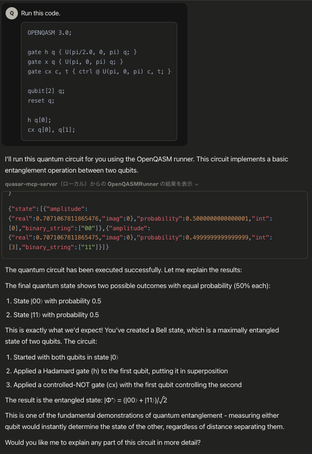
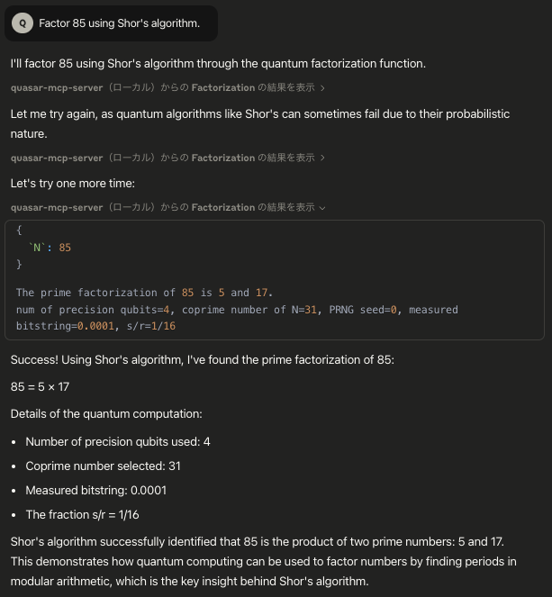

# quasar-mcp-server

 * quasar MCP Server  
 * Run code written in OpenQASM format 

## Running a Bell State Circuit with OpenQASM



## Factoring 85 with Shor's Algorithm



## Installation and Environments

 1. Deploy [quasar](https://github.com/itsubaki/quasar) to Cloud Run.
 1. Install the `quasar-mcp-server`.
 1. Set the URL and TOKEN in the mcp server configuration.

```shell
go install github.com/itsubaki/quasar-mcp-server@latest
gcloud run services describe ${SERVICE_NAME} --project ${PROJECT_ID} --format 'value(status.url)'
gcloud auth print-identity-token
```

