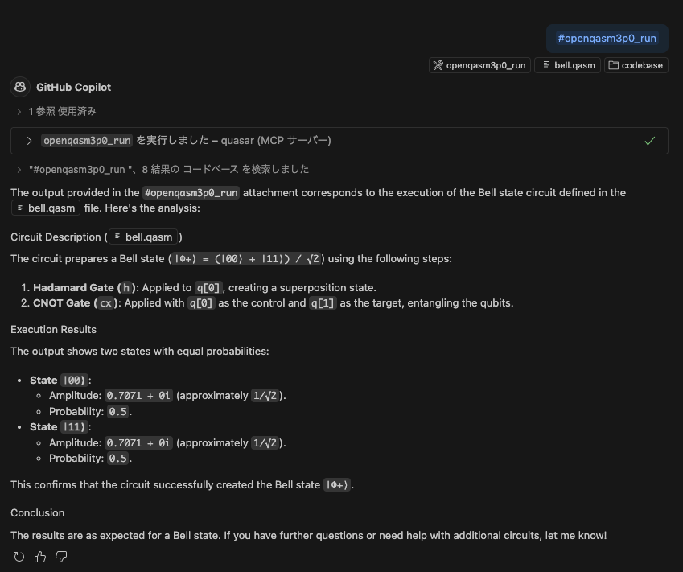

# quasar-mcp-server

 * quasar MCP server  
 * Run code written in OpenQASM format 

## Examples

### Running a Bell State Circuit with OpenQASM



## Deployment and Configuration

 1. Deploy [quasar](https://github.com/itsubaki/quasar) to Cloud Run.
 1. Deploy quasar-mcp-server to Cloud Run.
 1. Configure `settings.json`.

```shell
make build deploy
```

```json
{
    "mcp": {
        "servers": {
            "quasar": {
                "type": "http",
                "url": "https://${YOUR_CLOUD_RUN_SERVICE_URL}.run.app/mcp",
            }
        }
    }
}
```

## Invoke an Authenticated Cloud Run Service from localhost

```shell
make proxy
```

```json
{
    "mcp": {
        "servers": {
            "quasar": {
                "type": "http",
                "url": "http://127.0.0.1:3000/mcp",
            }
        }
    }
}
